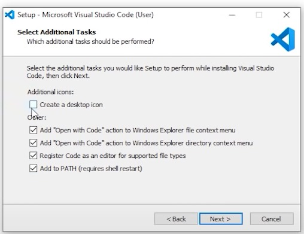

## Visual Studio Code Installation  
We will be using VS Code which is source-code editor made by Microsoft for Windows, Linux and macOS. 
Click here(https://code.visualstudio.com/) to download VS Code. 

**Note**
1. If you are using windows then download for windows and MacOs for Mac.
2. make sure you are downloading **stable** version. (Stable Build). 

### During installation 
Make sure to check all the box when it asks for **select additional Tools** as shown in the image below.

### After Installation
Install VS Code Studio Extension called "Live Server" available in VS Code itself. 

